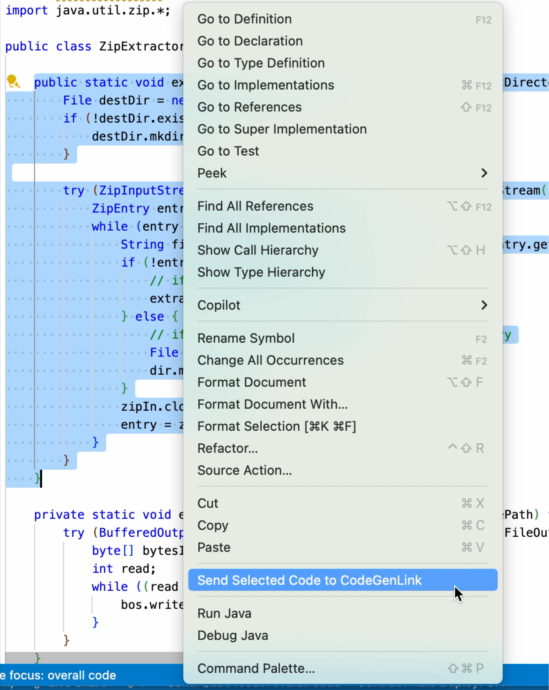

# CodeGenLink

## Description
**CodeGenLink** is a Visual Studio Code extension that interacts with GitHub Copilot Chat to generate code, analyze its origin, and identify the associated license.

## Prerequisites
- OpenAI token
- Python >= 3.9.x
- For the extension to work properly, you need to install:
  - [CCFinderSW](https://github.com/YuichiSemura/CCFinderSW)
  - [LicenseClassifier](https://github.com/google/licenseclassifier)

## Supported Programming Languages
CCFinderSW is a token-based clone detector, at the moment, it support programming languages such as:

  - Python
  - Java
  - Ruby
  - PHP
  - Go
  - C
  - C++
  - C#
  - ...


For the full list visit [CCFinderSW](https://github.com/YuichiSemura/CCFinderSW).

If you want to support other programming languages, you can extend it following the [guideline](https://github.com/YuichiSemura/CCFinderSW/blob/master/Usage/OptionFile.md) provided by the authors of the tool.

## Features

### CodeGenLink
Generates code via GitHub Copilot Chat and retrieves source links used during generation (web search is powered by the OpenAI tool `tool_web_search`). Uses cosine similarity and clone ratio to identify the most relevant sources and extract their licenses based on the domain.

### LinkSearcher
Analyzes selected code to find matching sources on the web (web search powered by `tool_web_search`), using similarity metrics, and extracts the license from each identified source.

## Installation
For users, to install a .vsix file in VS Code:

- From the Extensions view in VS Code:
  
  Go to the `Extensions view > Select Views and More Actions... > Install from VSIX...`

- From the command line:

  ```bash
  # If you use VS Code
  code --install-extension codegenlink-0.0.1.vsix
  ```


  ```bash
  # If you use VS Code Insiders
  code-insiders --install-extension codegenlink-0.0.1.vsix
  ```

## CodeGenLink Video Demo
  
  [YouTube](https://youtu.be/M6nqjBf9_pw)

## Configuration

You can configure the working parameters by following the instructions below:

- **For Windows**: Go to the menu `File > Preferences > Settings` and search `CodeGenLink Settings`.
- **For macOS**: Go to the menu `Code > Settings` and search `CodeGenLink Settings`.

### Configurable Parameters

- **AI model**: Specify the OpenAI model to use (e.g., `gpt-4o`, `gpt-4.1`). Refer to the [OpenAI documentation](https://platform.openai.com/docs/models) for supported models. *(Default: `gpt-4o`)*
- **APIKey**: Your OpenAI API key.
- **Temperature**: Controls creativity vs determinism. Higher values = more creative. *(Default: `1`)*
- **minLines**: Minimum number of code lines (excluding blanks) for both extracted and generated snippets. *(Default: `5`)*
- **cloneRatioThreshold**: Clone ratio threshold to include code from a source. *(Default: `60`)*
- **cosineSimilarityThreshold**: Cosine similarity threshold to include source links. *(Default: `0.6`)*
- **CCFinderSWPath**: Path to the `CCFinderSW` executable.
- **outputDir**: Directory to store analysis results.
- **minTokenLength**: Minimum token sequence length for CCFinderSW clone detection. *(Default: `20`)*
- **licenseclassifierPath**: Path to the folder containing `identify_license.go` for license classification.

## How to Use

The usage differs depending on the selected functionality:

- **CodeGenLink**: In the Copilot Chat input prompt, type your request prefixed with the tag `@CodeGenLink`. This will trigger code generation and source/license detection.

  

- **LinkSearcher**: Select the code in the editor, right-click, and choose **"Send Selected Code to Copilot"**. The extension will automatically analyze the selection and retrieve possible source links and license information.
    

### Recommended Prompt

```
You are a Senior <<LANGUAGE>> developer. Then give me a <<LANGUAGE>> code snippet about: <<QUERY>>.
```

> You don’t need to explicitly ask for a web search — the extension automatically performs it using an embedded secondary query:
>
> `Search the web to find links where I can get more information about this code. <<LANGUAGE>>, <<CLEAN_CODE>>`

### Results Display
Once the analysis is completed (via either **CodeGenLink** or **LinkSearcher**), the results are shown through a dedicated button located in the bottom-right corner of the Visual Studio Code status bar.

Clicking this button opens a view containing all the source links identified for the generated or selected code. Only links that **exceed at least one of the two configured thresholds** are displayed:
- `cloneRatioThreshold`
- `cosineSimilarityThreshold`

For each listed link, the **associated license** (if detectable) is also shown.


